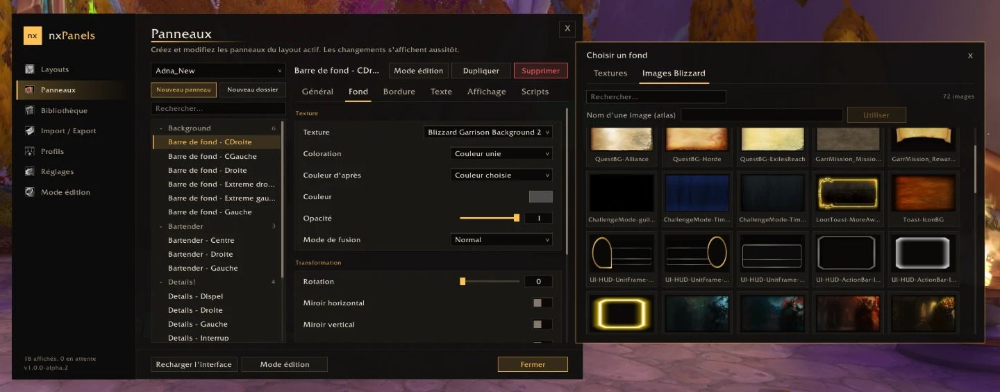
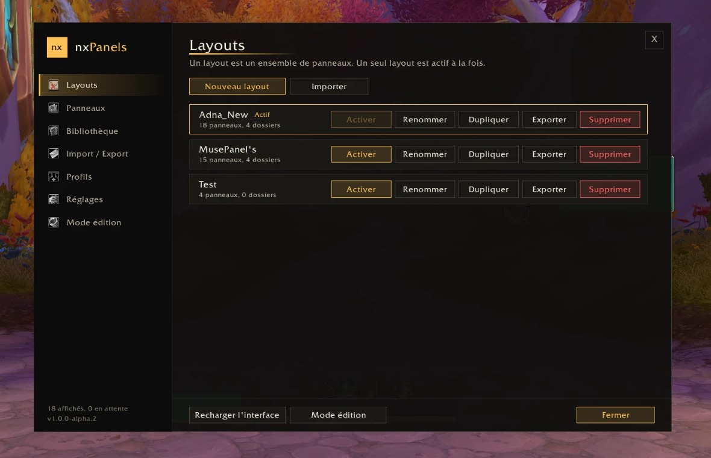
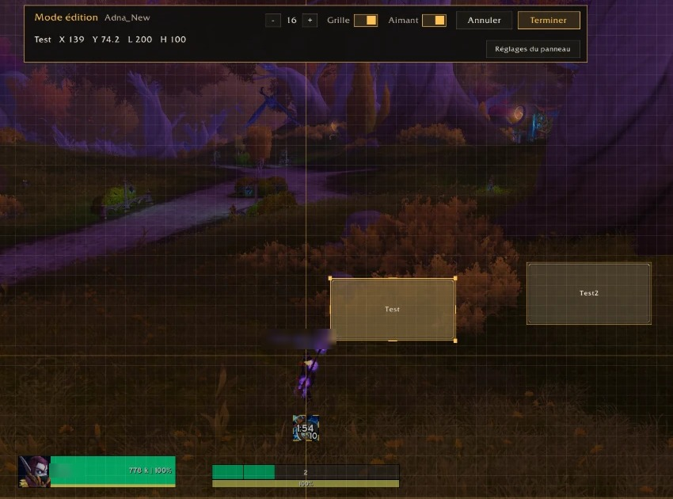

  

<h1 align="center">nxPanels</h1>

  Artistic panels for your World of Warcraft interface: backgrounds, borders, text and scripts, 
  placed anywhere and attached to any frame. Build an interface that is truly yours.

  
  
  
  
  
  

> 🚧 **Alpha.** Everything described here works in game on Retail and WoW Forever; the alpha is there to collect feedback before the first stable version. Please [report any problem](https://github.com/WillOli7/nxPanels/issues).

## Features

**Panels**
- Backgrounds: solid color, gradient, your own textures, SharedMedia textures and Blizzard images (atlases), chosen in a browser with thumbnails.
- Borders from any border texture, with size, insets and color.
- Automatic colors: class, faction, reaction of the target.
- Text with the font of your client language, and live variables without code: `{zone}`, `{time}`, `{fps}`, `{latency}`, `{gold}`, `{currency:<id>}`, `{item:<id>}`… plus every game icon.
- Attach a panel to any frame of the game or of another addon (Bartender, Details!, chat…) and it follows it.

**Display without scripts**
- Show or hide on conditions: combat, group or raid, instance type, mount, target, pet battles, or any macro condition (`[combat] show; hide`).
- Opacity at rest, in combat and under the mouse, with fades.

**Creation**
- Configuration window (`/nxp`), loaded only when you open it: changes are drawn at once.
- Edit mode (`/nxp edit`): move and resize with the mouse, snapping to the screen and to other panels with guides, arrow keys, multiple selection, alignment, undo.
- Templates to start from (info bar, bar frame, chat background, combat glow…).
- Folders to organize large layouts.
- Scripts for advanced users (OnLoad, OnEvent, OnUpdate, OnClick…), with a syntax check that shows the line of the error.

**Layouts and profiles**
- Several layouts, switched in one click or automatically per specialization (Retail) or talent group (WoW Forever).
- Profiles per character, class or faction.
- Share a layout, a folder or a single panel with a text string (`!NXP1!…`), with a warning when it contains scripts.
- Your own backgrounds and borders by file path, and an API for media packs (`nxPanels.RegisterMedia`).

**Light:** the display engine is small and always loaded; the window and the import module are separate addons.

## Screenshots

| | |
|---|---|
|  |  |

## Supported clients

| Client | Interface |
|---|---|
| Retail (12.x) | 120000 – 120100 |
| WoW Forever | 16001 |

One package works on both.

## Languages

| Language | State |
|---|---|
| English (enUS) | complete |
| Français (frFR) | complete |
| 简体中文 (zhCN) | complete, **review by a native speaker welcome** |
| 繁體中文 (zhTW) | complete, **review by a native speaker welcome** |

Every other client language works with English texts. Panel text always uses the font of your client, so Chinese, Korean and Russian text is readable. [Help translate](#translations).

## Installation

- **CurseForge app, WowUp or Wago app:** search for **nxPanels** and install it.
- **By hand:** download the zip from [the releases](https://github.com/WillOli7/nxPanels/releases), then extract every folder into `World of Warcraft\_retail_\Interface\AddOns` (or the AddOns folder of WoW Forever).

## Coming from kgPanels or kgPanels Reloaded

**Nothing to do.** nxPanels is the continuation of kgPanels Reloaded: the CurseForge app updates it like any other addon. On the first start, your layouts, panels, folders, profiles and custom art are imported automatically, then the old addon is disabled. Your old data is never modified.

- Old scripts keep working: `kgPanels` becomes `nxPanels`, with the same functions.
- Import again at any time with `/nxp import`. Old export strings can be pasted in Import / Export.
- With the original **kgPanels** installed, its data is imported too, then a window offers to reload the interface.

What is in the package:

| Folder | Role |
|---|---|
| `nxPanels` | The addon: displays your panels. Light, always loaded. |
| `nxPanels_Options` | The configuration window, loaded only when you open it. |
| `nxPanels_Import` | Imports your kgPanels and kgPanels Reloaded layouts. Can be disabled once done. |
| `kgPanels_Reloaded`, `kgPanelsConfig_Reloaded` | Small placeholders that replace the old addon folders, so your old data can be read. **Keep them** until your layouts are imported. |

## Commands

`/nxpanels` or `/nxp` opens the nxPanels window. Other commands:

| Command | Action |
|---|---|
| `/nxp edit` | edit mode: move and resize the panels with the mouse |
| `/nxp layouts` | list your layouts |
| `/nxp layout <name>` | activate a layout |
| `/nxp enable` / `disable` / `toggle` | show or hide the panels |
| `/nxp minimap` | show or hide the minimap button |
| `/nxp import` | import the kgPanels layouts again |
| `/nxp status` | version and diagnostics |
| `/nxp help` | list of the commands |

## For script authors

Scripts use `self.bg`, `self.text`, `arg1`… of OnEvent and the `pressed` / `released` variables of OnClick. The API is available as `nxPanels`: `GetPanelFrame(name)` (alias `FetchFrame`), `GetActiveLayout()`, `ActivateLayout(name)`, `RegisterMedia(kind, name, path)`, `Print(...)`. Every panel frame is also reachable as `nxPanel_<id>`.

A failing script is reported once and switched off until the next reload.

## Contributing

### Translations
Texts live in `nxPanels/Locales/<locale>.lua` and `nxPanels_Import/Locales.lua`. Every language file has the same keys as `enUS.lua`: translate the values, never the keys. Native speakers of **Simplified and Traditional Chinese** are especially welcome to review `zhCN.lua` and `zhTW.lua`; other languages (deDE, esES, koKR, ruRU, ptBR…) are welcome too.

Send a pull request, or open an issue with your corrections if you prefer not to use Git.

### Bugs and ideas
Open an [issue](https://github.com/WillOli7/nxPanels/issues) with the error text from BugSack / BugGrabber and the output of `/nxp status`. See [CONTRIBUTING.md](CONTRIBUTING.md) for code and pull requests.

### Development

| Tool | Command |
|---|---|
| Offline tests (LuaJIT) | `bash tools/tests/run-all.sh path/to/luajit` |
| Library versions | `bash tools/check-libs.sh` |
| Local install (Retail + WoW Forever) | `bash tools/deploy.sh all` |

[Libs-VERSIONS.md](Libs-VERSIONS.md) lists the embedded libraries, [CHANGELOG.md](CHANGELOG.md) the changes.

## Origins

nxPanels exists thanks to **kgPanels** by **kagaro**, successor of **eePanels**. These addons showed how far an interface can go with a few well-placed panels, and made me want to carry the idea further: a more modern and practical interface for long-time users, and for new players who want an interface that belongs to them.

nxPanels is a complete rewrite and does not reuse their code, but it keeps their spirit. Thank you to their authors and to everyone who kept them alive.

## License

nxPanels is free to download and use, and it will stay free. The code is public so that you can read it and report problems, but it is not open source: copying, modifying or re-uploading it requires my permission. Details in [LICENSE](LICENSE); the embedded libraries keep their own licenses.
